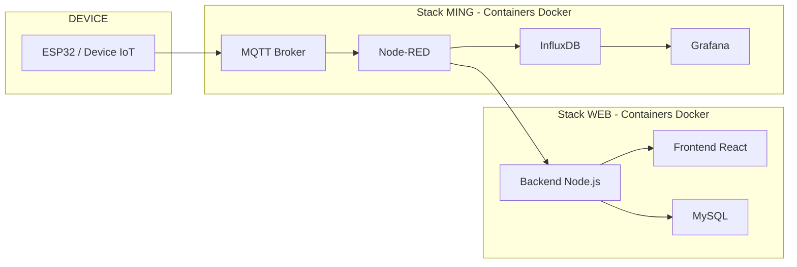

# Arquitetura do Sistema

Este documento complementa o README principal, detalhando decisões de infraestrutura, uso de containers e simplificações adotadas no projeto.

## Uso de Docker na Arquitetura

### O que é Docker

Docker é uma plataforma de virtualização leve baseada em containers, que permite empacotar aplicações e suas dependências em ambientes isolados e reproduzíveis.

Diferente de máquinas virtuais tradicionais, containers:

* Compartilham o kernel do sistema operacional
* São mais leves e rápidos
* Facilitam portabilidade entre ambientes
* Garantem consistência entre desenvolvimento, teste e produção

### Por que usar Docker neste projeto

O uso de Docker permite:

* Padronizar o ambiente de execução
* Subir toda a arquitetura com um único comando (`docker compose up`)
* Isolar serviços (MQTT, Node-RED, InfluxDB, etc.)
* Evitar problemas de dependências e configuração manual

Cada componente da arquitetura roda como um container independente, mas integrado via rede interna do Docker.

### Docker Compose

O Docker Compose foi utilizado para orquestrar todos os serviços.

Ele permite definir toda a infraestrutura em um único arquivo (`docker-compose.yml`), incluindo:

* Serviços
* Portas
* Volumes
* Dependências

Isso transforma a infraestrutura em **Infrastructure as Code (IaC)** simplificada.

## Arquitetura com Containers

## Decisão de Infraestrutura (AWS)

### Abordagem ideal (produção)

Em um cenário enterprise na AWS, o ideal seria utilizar serviços gerenciados, como:

* **ECR (Elastic Container Registry)**

  * Repositório de imagens Docker
  * Versionamento e distribuição de containers

* **IoT Core**

  * Broker MQTT totalmente gerenciado
  * Escalável e seguro
  * Integração nativa com outros serviços AWS

Além disso, seria comum utilizar:

* ECS ou EKS (orquestração de containers)
* RDS (banco relacional gerenciado)
* CloudWatch (monitoramento)

### Por que não usamos essa abordagem

Apesar de ser o cenário ideal, optamos por uma abordagem simplificada:

* Toda a arquitetura roda em uma única instância EC2
* Utilizamos Docker + Docker Compose
* MQTT é local (Mosquitto), não IoT Core
* Não utilizamos ECR

### Justificativa da simplificação

Essa decisão foi tomada porque:

1. O foco do projeto é a **Stack MING e o pipeline de dados**
2. Reduz a complexidade inicial
3. Facilita o aprendizado e experimentação
4. Evita dependência de múltiplos serviços gerenciados

### Complexidade do uso de IoT Core e ECR

Para utilizar corretamente serviços como IoT Core e ECR, é necessário conhecimento mais avançado em:

* Redes (VPC, subnets, routing)
* Segurança (IAM, policies, certificates)
* Autenticação de dispositivos (certificados X.509)
* Pipeline de build e deploy (CI/CD)

Isso adiciona uma camada significativa de complexidade que foge do objetivo principal deste projeto.

## Estratégia de Deploy

### Abordagem adotada

* Instância EC2 única
* Docker instalado
* Docker Compose executando todos os serviços
* Exposição de portas diretamente

Essa abordagem é suficiente para:

* Ambiente educacional
* Protótipos
* Provas de conceito (PoC)

## Monorepositório vs Multirepositório

### Abordagem adotada: Monorepositório

Todo o projeto está organizado em um único repositório contendo:

* Backend
* Frontend
* Configurações do Docker
* Stack MING

### Vantagens do monorepositório

* Facilidade de setup (um clone, tudo funciona)
* Visão centralizada do sistema
* Simplicidade para ensino e demonstração
* Menor complexidade de integração

### Abordagem ideal (produção)

Em ambientes profissionais, o mais recomendado seria separar em múltiplos repositórios:

* backend-service
* frontend-app
* iot-pipeline (MING)
* infra (Terraform / Docker / Kubernetes)

### Vantagens do multirepositório

* Times independentes
* Deploy desacoplado
* Versionamento isolado
* Melhor escalabilidade organizacional

### Trade-off adotado

Neste projeto:

* Priorizamos simplicidade e clareza
* Reduzimos barreiras de entrada
* Facilitamos o uso em ambiente acadêmico

## Considerações Finais

A arquitetura implementada representa um equilíbrio entre:

* Boas práticas de mercado
* Simplicidade operacional
* Foco educacional

Mesmo simplificada, ela mantém conceitos fundamentais como:

* Separação de responsabilidades
* Pipeline de dados desacoplado
* Uso de containers
* Arquitetura orientada a eventos

Essa base permite evolução futura para:

* Arquitetura cloud nativa
* Uso de IoT Core
* CI/CD com ECR
* Orquestração com Kubernetes

